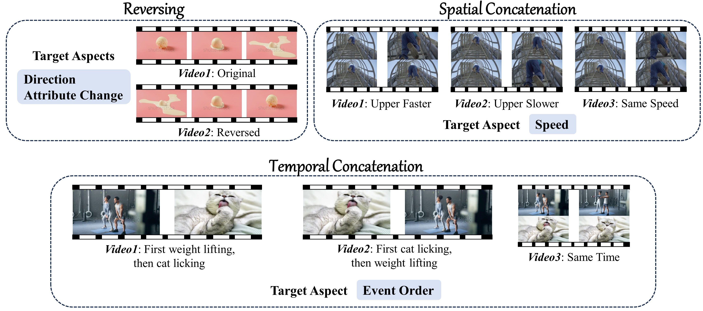
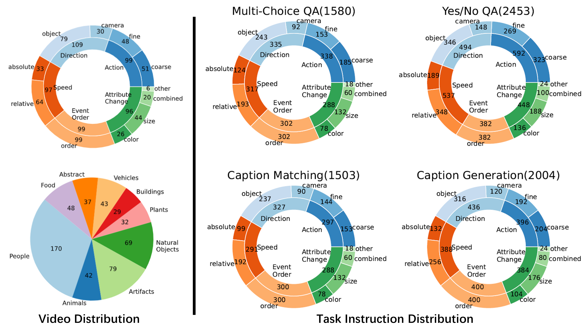

<h2 align="center"> <a href="https://arxiv.org/abs/2403.00476">TempCompass: A benchmark to evaluate the temporal perception ability of Video LLMs</a></h2>

<div align="center">
    <a href='https://arxiv.org/abs/2403.00476'></a>
    <a href='https://llyx97.github.io/tempcompass/'></a>
</div>

<div>
<div align="center">
    <a href='https://llyx97.github.io/' target='_blank'>Yuanxin Liu<sup>1</sup></a>&emsp;
    <a href='https://lscpku.github.io/' target='_blank'>Shicheng Li<sup>1</sup></a>&emsp;
    <a href='https://liuyi-pku.github.io/' target='_blank'>Yi Liu<sup>1</sup></a>&emsp;
    Yuxiang Wang<sup>1</sup>&emsp;
    <a href='https://renshuhuai-andy.github.io/' target='_blank'>Shuhuai Ren<sup>1</sup></a>&emsp;
    </br>
    <a href='https://lilei-nlp.github.io/' target='_blank'>Lei Li<sup>2</sup></a>&emsp;
    <a href='https://pkucss.github.io/' target='_blank'>Sishuo Chen<sup>1</sup></a>&emsp;
    <a href='https://xusun26.github.io/' target='_blank'>Xu Sun<sup>1</sup></a>&emsp;
    <a href='https://houlu369.github.io/' target='_blank'>Lu Hou<sup>3</sup></a>
</div>
<div>
<div align="center">
    <sup>1</sup>Peking University&emsp;
    <sup>2</sup>The University of Hong Kong&emsp;
    <sup>3</sup>Huawei Noah’s Ark Lab
</div>

## 📢 News

**[2024-05-25]** [TempCompass Leaderboard](https://huggingface.co/spaces/lyx97/TempCompass) is available on HuggingFace Space 🤗.

**[2024-05-16]** 🎊🎊🎊 TempCompass is accepted at ACL 2024 Findings!

**[2024-04-14]** Evaluation [result](#eval_result) of Gemini-1.5-pro, the current SOTA Video LLM, is add.

**[2024-03-23]** The [answer prompt](#answer_prompt) is improved to better guide Video LLMs to follow the desired answer formats. The [evaluation code](#eval) now provides an option to disable the use of ChatGPT.

**[2024-03-12]** 🔥🔥🔥 The evaluation code is released now! Feel free to evaluate your own Video LLMs.

## ✨ Highlights
### Diverse Temporal Aspects and Task Formats
- TempCompass encompasses a diverse set of temporal aspects (left) and task formats (right) to comprehensively evaluate the temporal perception capability of Video LLMs.

### Conflicting Videos
- We construct conflicting videos to prevent the models from taking advantage of single-frame bias and language priors.

  
- 🤔 Can your Video LLM correctly answer the following question for both two videos?
  
    
    
    
    > What is happening in the video?    
    > A. A person drops down the pineapple    
    > B. A person pushes forward the pineapple    
    > C. A person rotates the pineapple    
    > D. A person picks up the pineapple

## 🚀 Quick Start
To begin with, clone this repository and install some packages:
```shell
git clone https://github.com/llyx97/TempCompass.git
cd TempCompass
pip install -r requirements.txt
```

### Data Preparation
**1. Task Instructions**

The task instructions can be found in `questions/`.

<details>
<summary><span id="instruct_gen"> Task Instruction Generation Procedure </span></summary>
    
1. Generate **Multi-Choice QA** instructions (`question_gen.py`). 

2. Manually validate quality and rectify.

3. Generate task instructions for **Yes/No QA** (`question_gen_yes_no.py`), **Caption Matching** (`question_gen_caption_match.py`) and **Caption Generation** (`question_gen_captioning.py`), based on manually rectified **Multi-Choice QA** instructions.
   
4. Manually validate quality and rectify.
</details>

**2. Videos**

Run the following commands. The videos will be saved to `videos/`.
```shell
cd utils
python download_video.py    # Download raw videos
python process_videos.py    # Construct conflicting videos
```

### Run Inference
We use [Video-LLaVA](https://github.com/PKU-YuanGroup/Video-LLaVA) and [Gemini](https://github.com/google-gemini/cookbook/blob/98a74b3cde77e518032928acec2fab8b8f3b41be/preview/file-api/File_API_Video.ipynb) as examples to illustrate how to conduct MLLM inference on our benchmark.

**1. Video-LLaVA**

Enter `run_video_llava` and install the environment as instructed.

Then run the following commands. The prediction results will be saved to `predictions/video-llava/<task_type>`.
```shell
# select <task_type> from multi-choice, yes_no, caption_matching, captioning
python inference_dataset.py --task_type <task_type>
```

**2. Gemini**

The inference script for gemini-1.5-pro is `run_gemini.ipynb`. It is recommended to run the script in [Google Colab](https://colab.research.google.com/).

### <span id="eval"> Run Evaluation </span>
After obtaining the MLLM predictions, run the following commands to conduct automatic evaluation. Remember to set your own `$OPENAI_API_KEY` in `utils/eval_utils.py`.

- **Multi-Choice QA**
`python eval_multi_choice.py --video_llm video-llava`

- **Yes/No QA**
`python eval_yes_no.py --video_llm video-llava`

- **Caption Matching**
`python eval_caption_matching.py --video_llm video-llava`

- **Caption Generation**
`python eval_captioning.py --video_llm video-llava`

**Tip**👉: Except for *Caption Generation*, you can set `--disable_llm` when running the scripts, which will disable chatgpt-based evaluation (i.e., entirely rely on rule-based evaluation). **This is useful when you do not want to use ChatGPT API and your MLLM is good at following the instruction to generate answers of specific format.**

The results of each data point will be saved to `auto_eval_results/video-llava/<task_type>.json` and the overall results on each temporal aspect will be printed out as follows:
```
{'action': 76.0, 'direction': 35.2, 'speed': 35.6, 'order': 37.7, 'attribute_change': 41.0, 'avg': 45.6}
{'fine-grained action': 58.8, 'coarse-grained action': 90.3, 'object motion': 36.2, 'camera motion': 32.6, 'absolute speed': 47.6, 'relative speed': 28.0, 'order': 37.7, 'color & light change': 43.6, 'size & shape change': 39.4, 'combined change': 41.7, 'other change': 38.9}
Match Success Rate=100.0
```

## 📈 Data Statistics


## 📊 <span id="eval_result"> Evaluation Results </span>
The following figures present results of [Video-LLaVA](https://github.com/PKU-YuanGroup/Video-LLaVA), [VideoChat2](https://github.com/OpenGVLab/Ask-Anything/tree/main/video_chat2), [SPHINX-v2](https://github.com/Alpha-VLLM/LLaMA2-Accessory/tree/main/SPHINX), [Gemini-1.5-pro](https://github.com/google-gemini/cookbook/blob/98a74b3cde77e518032928acec2fab8b8f3b41be/preview/file-api/File_API_Video.ipynb) and the random baseline. Results of more Video LLMs and Image LLMs can be found in our [paper](https://arxiv.org/abs/2403.00476).


### <span id="answer_prompt"> Answer Prompt </span>
We update the answer prompt for *Multi-Choice QA* and *Caption Matching*, from "Best Option:" to "Please directly give the best option:", which can better encourage MLLMs to directly select an option. As such, we can reduce the reliance on ChatGPT API, if an MLLM is good at following the instruction.

The success rate of rule-based matching is as follows:

**Multi-Choice QA**
|  | V-LLaVA | SPHINX-v2    | LLaMA-VID | Qwen-VL-Chat | PandaGPT  | Valley  |
| --- | --- | --- | --- | --- | --- | --- |
| old prompt | 37.9 | 99.6 | 62.9 | 46.8 | 6.4 | 3.5 |
| new prompt | 100 | 100 | 97.0 | 98.5 | 3.9 | 0.4 |

**Caption Matching**
|  | V-LLaVA | SPHINX-v2    | LLaMA-VID | Qwen-VL-Chat | PandaGPT  | Valley  |
| --- | --- | --- | --- | --- | --- | --- |
| old prompt | 76.6 | 89.3 | 44.5 | 91.6 | 30.7 | 11.2 |
| new prompt | 99.5 | 99.5 | 68.3 | 96.0 | 22.5 | 3.7 |

## TODOs
- [x] Upload scripts to collect and process videos.
- [x] Upload the code for automatic evaluation.
- [x] Upload the code for task instruction generation.

## Citation
```bibtex
@article{liu2024tempcompass,
  title   = {TempCompass: Do Video LLMs Really Understand Videos?},
  author  = {Yuanxin Liu and Shicheng Li and Yi Liu and Yuxiang Wang and Shuhuai Ren and Lei Li and Sishuo Chen and Xu Sun and Lu Hou},
  year    = {2024},
  journal = {arXiv preprint arXiv: 2403.00476}
}
```
